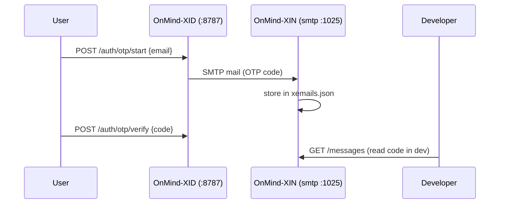

# OnMind-XIN — eXpress Inbox / Sink (Amazon SES like)

**OnMind-XID** is an eXpress Inbox. It sounds like Sink because it catches email messages for proofs of concept and labs.

Companion of [**OnMind-XID**](https://github.com/kaesar/onmind-xid) to use **OTP** by Email. Emulates the **Amazon SES API** for local development and stores every received message (avoid to use real **SES**).

- HTTP API: SESv2 JSON emulation (`SendEmail` / `SendBulkEmail` via `X-Amz-Target`)
  + friendly REST (`POST /send`, `GET /messages`, `GET /messages/:id`).
- Inbound SMTP on `0.0.0.0:1025` (what XID sends to Mailpit gets stored here).
- Dual storage: `xemails.json` (local, no extra dependencies) or DynamoDB `xemails`
  (pk `messageId`, TTL `ttl` = now + 30 days).
- Local: Hono + Bun 1.4. Lambda: Node.js 24 pure JS.

## Quick start

```bash
bun install
bun run dev
```

> The service listens on `localhost` on ports `8787` and `1025`, storing in `xemails.json`

```bash
curl -s http://localhost:8787/health
curl -s -X POST http://localhost:8787/send -H 'Content-Type: application/json' \
  -d '{"to":"dest@example.com","from":"noreply@mydomain.com","subject":"Hello","text":"Hello"}'
curl -s http://localhost:8787/messages?limit=5
```

> `html` and `text` are both optional and independent: send either, both, or
> neither — XIN stores them as-is with no coherence check. Email convention is
> to carry the same content in both (`multipart/alternative`), but that is up
> to the sender. Example with both:
>
> ```bash
> curl -s -X POST http://localhost:8787/send -H 'Content-Type: application/json' \
>   -d '{"to":"dest@example.com","from":"noreply@mydomain.com","subject":"Hello","html":"<h1>Hello</h1>","text":"Hello"}'
> ```

## Integration with OnMind-XID

Point XID's SMTP to XIN (`.env`):

```bash
XID_SMTP_HOST=127.0.0.1
XID_SMTP_PORT=1025
```

OTPs sent by XID end up stored in XIN: `GET /messages` → `text` holds the code.



## AWS SDK (point to XIN instead of SES)

```js
import { SESv2Client, SendEmailCommand } from "@aws-sdk/client-sesv2";
const ses = new SESv2Client({ region: "us-east-1", endpoint: "http://localhost:8787" });
const out = await ses.send(new SendEmailCommand({
  FromEmailAddress: "noreply@mydomain.com",
  Destination: { ToAddresses: ["dest@example.com"] },
  Content: { Simple: { Subject: { Data: "Hello" }, Body: { Text: { Data: "code 123456" } } } },
}));
console.log(out.MessageId); // == messageId in GET /messages/:id
```

## SMTP (swaks)

```bash
swaks --to dest@example.com --from noreply@mydomain.com \
  --server localhost --port 1025 --header-Subject "OTP" --body "code 123456"
curl -s http://localhost:8787/messages?limit=1
```

## Environment variables

| Var | Usage (default) |
|---|---|
| `PORT` | local http (`8787`) |
| `XIN_SMTP_PORT` / `XIN_SMTP_HOST` | smtp (`1025` / `0.0.0.0`) |
| `XIN_STORAGE` | `json` \| `dynamodb` (auto: `dynamodb` if `XIN_TABLE` is set) |
| `XIN_JSON_PATH` | `./xemails.json` |
| `XIN_TABLE` | DynamoDB table (`xemails`) |
| `XIN_DYNAMO_ENDPOINT` | custom endpoint (LocalStack / dynamodb-local / Floci) |
| `XIN_API_KEY` | if set, requires `x-api-key` (except `/health`); in prod sits behind API Gateway + Usage Plan |
| `XIN_CORS_ORIGINS` | CORS allowlist (`*`) |
| `XIN_ENV` | `dev` \| `production` |

## DynamoDB / Lambda

`xemails` table: pk `messageId` (S), TTL attribute `ttl` (N, epoch). Create it with TTL
enabled on `ttl` and deploy `src/lambda.handler` (Node.js 24, Function URL or
HTTP API Gateway v2). On Lambda there is only the HTTP API (no SMTP); use `XIN_TABLE` +
`XIN_API_KEY` and protect it with API Key + Usage Plan.

```bash
aws dynamodb create-table --table-name xemails \
  --attribute-definitions AttributeName=messageId,AttributeType=S \
  --key-schema AttributeName=messageId,KeyType=RANGE \
  --billing-mode PAY_PER_REQUEST
aws dynamodb update-time-to-live --table-name xemails \
  --time-to-live-specification Enabled=true,AttributeName=ttl
```

## Docker

```bash
docker build -t onmind-xin .
docker run -d --name xin -p 8787:8787 -p 1025:1025 -v /srv/xin:/data onmind-xin
```

## Tests

```bash
bun run smoke
```
