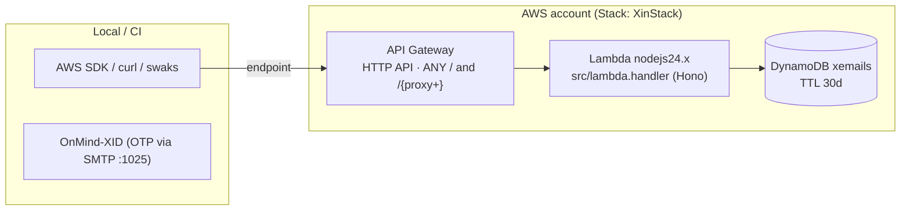

# OnMind-XIN — AWS architecture (CDK)

Infrastructure as code for running XIN on AWS (MVP: two gateways, no shared
domain — XID keeps its own `XidStack`/`XidHttpApi`):

- **API Gateway (HTTP API v2)** — public front door for the SES emulation
  (`POST /` with `X-Amz-Target`) and the readers (`POST /send`,
  `GET /messages`). Auth (`x-api-key`) is enforced **by the app**, not the
  gateway — same parity idea as XID.
- **AWS Lambda** (`nodejs24.x`) — runs the same Hono app as the Bun container.
  Handler: `src/lambda.handler`, packaged as a **repo-root asset** (no bundler).
  HTTP API only (no SMTP on Lambda).
- **DynamoDB (on-demand)** — single table `xemails` (pk `messageId` S,
  TTL attribute `ttl` N = now + 30 days, full entry in `data` S).

> CDK app is plain **JavaScript** (CJS, no TypeScript): `bin/app.js` +
> `lib/xin-stack.js`. Node ≥ 20 required.

## Diagram



Parity: `bun src/dev.js` (container) and Lambda share `src/` — only the
entrypoint and the storage binding differ.

## Configuration reference

All config is **CDK context** (defaults in `cdk/cdk.json`, override with
`-c key=value`) plus one optional secret:

| Context              | Default        | Maps to / effect                                   |
| -------------------- | -------------- | -------------------------------------------------- |
| `apiKey`             | *(empty = open)* | `XIN_API_KEY` — prefer `export XIN_API_KEY=...` so the secret stays out of argv/history |
| `tablePrefix`        | `""`           | table name `{prefix}xemails` (multi-env accounts) |
| `xinEnv`             | `production`   | `XIN_ENV`                                          |
| `removalPolicy`      | `retain`       | `retain` \| `destroy` — see “DynamoDB in production” |
| `deletionProtection` | `true`         | blocks even explicit `DeleteTable` while stack exists |
| `pointInTimeRecovery`| `true`         | 35-day PITR                                         |
| `terminationProtection` | `false`      | CloudFormation stack deletion guard (enable in prod) |
| `corsOrigins`        | `""`           | comma list → `XIN_CORS_ORIGINS`                     |
| `localEndpoint`      | `""`           | emulator URL → `AWS_ENDPOINT_URL` + `XIN_DYNAMO_ENDPOINT` inside the Lambda (Floci/LocalStack) |

Lambda environment (set by the stack): `XIN_ENV`, `XIN_STORAGE=dynamodb`,
`XIN_TABLE`, plus optional `XIN_API_KEY` / `XIN_CORS_ORIGINS`.

## DynamoDB in production

Defaults mirror XID — **a `cdk destroy` never loses data**:

| Setting                | Default   | Why                                                                 |
| ---------------------- | --------- | ------------------------------------------------------------------- |
| `removalPolicy`        | `RETAIN`  | Table (and data) stays in the account after stack deletion |
| `deletionProtection`   | `enabled` | even a hand-issued `DeleteTable` is rejected until disabled explicitly |
| `pointInTimeRecovery`  | `enabled` | 35-day point-in-time recovery |
| `billingMode`          | `PAY_PER_REQUEST` | on-demand — no capacity planning |
| TTL on `xemails`       | `ttl`     | messages auto-delete after 30 d (lazy ≤ 48 h) |
| Log group              | RETAIN + 14 d | function logs survive destroy, expire after 14 days |

- **Throwaway envs** (Floci, CI): pass
  `-c removalPolicy=destroy -c deletionProtection=false -c pointInTimeRecovery=false`
  so everything is disposable.

## Deploy (real AWS)

```bash
# one-time
export AWS_PROFILE=your-profile
cd cdk && npm install
npx cdk bootstrap                                # once per account/region

# every deploy
npx cdk diff
npx cdk deploy -c corsOrigins=https://app.example.com
# → ApiEndpoint output (+ ApiId for a future custom-domain mapping)
```

With `XIN_API_KEY` in prod:

```bash
export XIN_API_KEY=$(openssl rand -hex 32)      # never commit this
npx cdk deploy
```

Then point the AWS SDK `endpoint` (or XID checks) at the `ApiEndpoint` output,
sending `x-api-key` on every call except `/health`.

## Test with the Floci simulator

Same recipe as XID (Floci on **:4566**, drop-in endpoint):

```bash
docker run -d --name floci -p 4566:4566 \
  -v /var/run/docker.sock:/var/run/docker.sock \
  floci/floci:latest

export AWS_ENDPOINT_URL=http://localhost:4566
export AWS_ACCESS_KEY_ID=test AWS_SECRET_ACCESS_KEY=test AWS_REGION=us-east-1
export AWS_PAGER=
export CDK_DEFAULT_ACCOUNT=000000000000 CDK_DEFAULT_REGION=us-east-1

cd cdk
npx cdk bootstrap
npx cdk deploy \
  -c removalPolicy=destroy \
  -c deletionProtection=false \
  -c pointInTimeRecovery=false \
  -c localEndpoint=http://host.docker.internal:4566

API=$(aws cloudformation describe-stacks --stack-name XinStack \
      --query "Stacks[0].Outputs[?OutputKey=='ApiEndpoint'].OutputValue" --output text)
curl -fsS "$API/health"
```

## Security notes

- `XIN_API_KEY` is optional at synth; set it for prod (lands in the Lambda
  environment — move to **Secrets Manager** when hardening for long-lived prod).
- CORS is enforced by the app (same behaviour on both runtimes); the gateway
  adds no second policy to keep parity.
- Asset packaging never ships `xemails.json` / `.env` / `.dev.vars`.

## Commands

```bash
cd cdk
npm run synth      # cdk synth
npm run diff       # cdk diff
npm run deploy     # cdk deploy
npm run destroy    # cdk destroy
npm run bootstrap  # cdk bootstrap (once per account/region)
```
